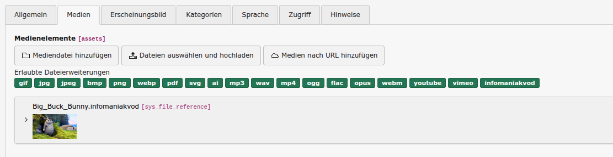
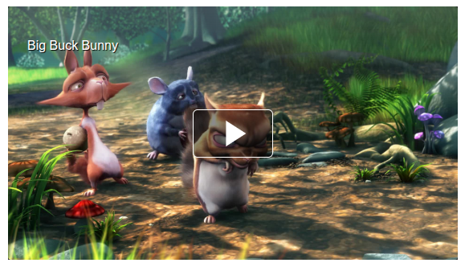

# Infomaniak VOD TYPO3 Extension

## What does it do?

You can use this extension to manage your Infomaniak VOD videos in TYPO3. You can add new videos by using the Text/Media content element.

## Screenshots

## Installation

You can use the site set or typoscript extension configuration to overide the default video rendering. But it is recommended
to extend the own template to support responsive player rendering.

